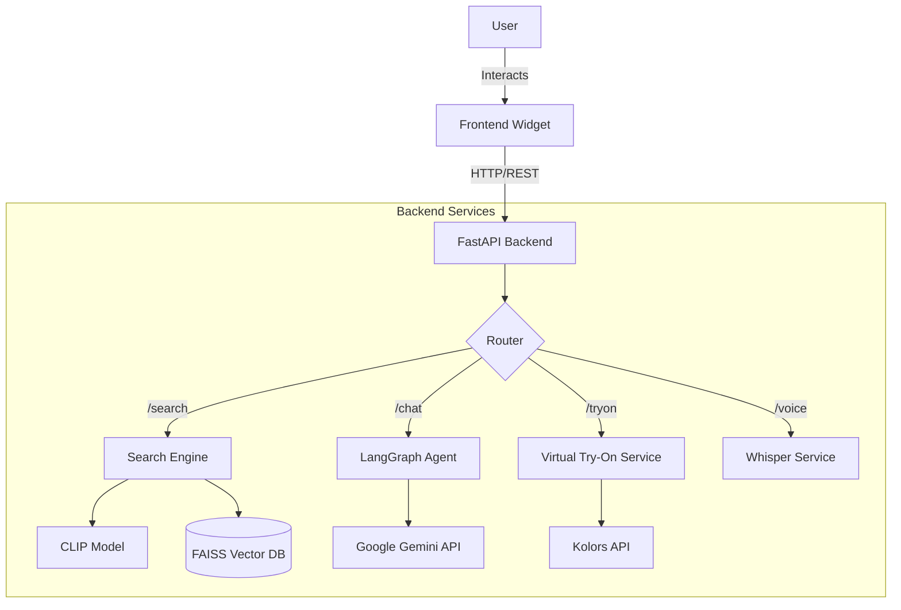

# Dressify - AI Fashion Assistant 👗✨

**Dressify** is an advanced AI-powered fashion commerce assistant that revolutionizes how users shop for clothes. It combines **multimodal search** (text, image, and hybrid), **voice interaction**, **virtual try-on**, and a **generative AI stylist** into a single, seamless widget that can be embedded into any e-commerce platform.


## 🚀 Key Features

### 1. 🧠 Multimodal Hybrid Search
- **Text Search**: Understands natural language queries like "boho chic summer dress" using semantic understanding.
- **Visual Search**: Upload an image to find visually similar items using **CLIP** embeddings.
- **Hybrid Search**: Combine text and image (e.g., upload a photo of a jacket and ask for "this but in red leather") using weighted vectors (FAISS + CLIP).

### 2. 👕 Virtual Try-On (VTON)
- **Kolors API Integration**: Users can upload a photo of themselves and a garment to see how it looks on them.
- **Realistic Generation**: Uses state-of-the-art diffusion models to preserve garment details and body posture.

### 3. 🎙️ Voice Commerce
- **Voice-to-Text**: Integrated **Whisper** model allows users to shop hands-free by speaking their tailored queries.
- **Natural Interaction**: "Show me black sneakers under $50" is instantly transcribed and executed.

### 4. 🤖 AI Personal Stylist
- **Generative Chat**: Powered by **Google Gemini**, the assistant acts as a personal stylist, offering fashion advice, outfit combinations, and trend insights.
- **Context Aware**: Remembers conversation history for a coherent shopping experience.

---

## 🏗️ Technical Architecture

Dressify is built as a modular system with a Python FastAPI backend and a lightweight, embeddable JavaScript frontend.



## 🛠️ Tech Stack

### Backend
- **Framework**: FastAPI (Python 3.10+)
- **Orchestration**: LangGraph (for stateful agent workflows)
- **AI Models**:
  - **Vision/Embedding**: `patrickjohncyh/fashion-clip`
  - **LLM**: Google Gemini (`gemini-2.0-flash-lite`)
  - **STT**: OpenAI Whisper (`openai/whisper-small.en`)
  - **VTON**: Kolors Virtual Try-On API
- **Vector Database**: FAISS (Facebook AI Similarity Search)
- **Data Prcoessing**: Pandas, NumPy, Pillow

### Frontend
- **Core**: Vanilla JavaScript (ES6+), HTML5, CSS3
- **Styling**: Custom "Magic UI" CSS variables, Glassmorphism design
- **Server**: Express.js (for serving static assets and proxying)

---

## 📋 Prerequisites

- **Python 3.10+** installed
- **Node.js 18+** installed
- **FFmpeg** installed (required for audio processing)
- **API Keys**:
  - Google Gemini API Key
  - Kolors API Key (for Virtual Try-On)

---

## ⚡ Installation & Setup

### 1. Clone the Repository
```bash
git clone https://github.com/Start-Tech-Team/dressify.git
cd dressify/fashion-ai-assistant
```

### 2. Backend Setup
```bash
cd backend
# Create virtual environment (recommended)
python -m venv venv
source venv/bin/activate  # or venv\Scripts\activate on Windows

# Install dependencies
pip install -r requirements.txt

# Configure Environment
cp .env.example .env
```

**Edit `backend/.env`:**
```ini
BACKEND_PORT=8000
# Google Gemini (Required for Chat/Search)
GEMINI_API_KEY=your_gemini_key_here
# Kolors (Required for Try-On)
KOLORS_API_KEY=your_kolors_key_here
KOLORS_SECRET_KEY=your_kolors_secret_here
VIRTUAL_TRYON_ENABLED=true
```

### 3. Frontend Setup
```bash
cd ../frontend
npm install

# Configure Environment
cp .env.example .env
```

**Edit `frontend/.env`:**
```ini
PORT=3000
BACKEND_URL=http://localhost:8000
```

---

## 🏃‍♂️ Running the Application

You can start the application using the provided helper script or manually.

### Option A: Using Helper Script (Mac/Linux)
```bash
# From project root
./run.sh
```

### Option B: Manual Start

**Terminal 1 (Backend)**
```bash
cd backend
uvicorn app.main:app --reload --port 8000
```

**Terminal 2 (Frontend)**
```bash
cd frontend
npm start
```

Open **`http://localhost:3000`** in your browser to see the demo store with the Dressify widget.

---

## 📖 API Documentation

Once the backend is running, full interactive documentation (Swagger/Redoc) is available at:
- **Swagger UI**: `http://localhost:8000/docs`
- **ReDoc**: `http://localhost:8000/redoc`

### Key Endpoints

| Method | Endpoint | Description |
|--------|----------|-------------|
| `POST` | `/api/search` | Multimodal search (text, image, hybrid) |
| `POST` | `/api/chat` | Chat with the AI Stylist |
| `POST` | `/api/tryon` | Generate virtual try-on image |
| `POST` | `/api/voice/transcribe` | Transcribe audio blob to text |
| `GET` | `/api/products/{id}` | Get specific product details |

---

## 👥 Meet the Team

| Name | Role | GitHub |
|------|------|--------|
| **Abdullah Emara** | AI Engineer / Team Lead | [@Abdullah182155](https://github.com/Abdullah182155) |
| **Ahmed Hassan** | Fullstack Developer | - |
| **Ahmed Yahia** | Computer Vision Engineer | - |
| **Enas Emad** | Data Scientist | [@EnasEmad](https://github.com/EnasEmad) |
| **Aya Abdallah** | Frontend Developer | - |

---

## 📄 License

This project is licensed under the MIT License - see the [LICENSE](LICENSE) file for details.
